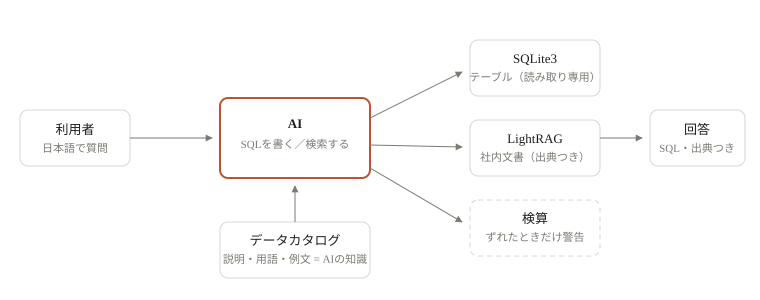
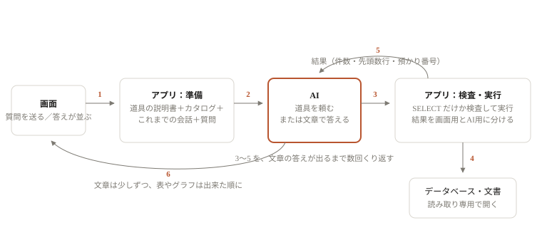
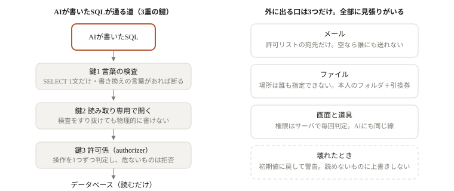
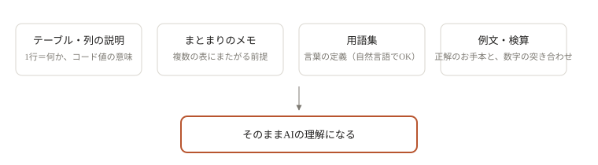
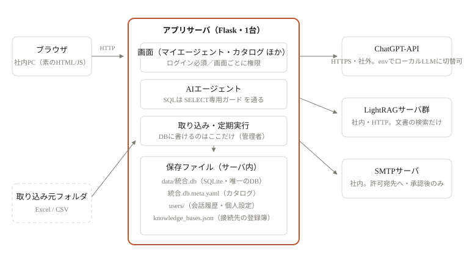
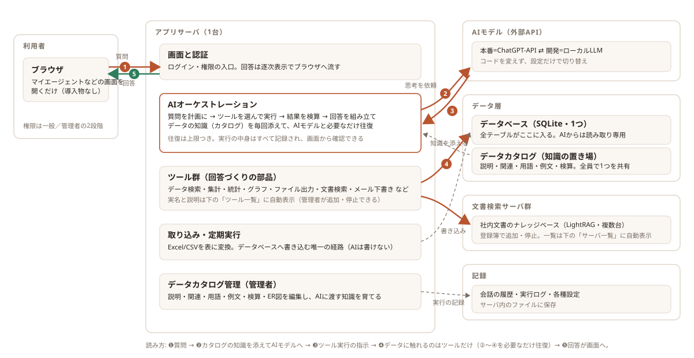

[目次へ戻る](README.md)

<a id="arch"></a>

## 第2部 システム構成の説明

### 質問が答えになるまで

AIは何も知らない状態から出発しません。**データカタログに書かれた内容がそのままAIの理解**になり、答えのあとには検算が自動で走ります。



安全のための決まり: AIが実行できるのは**読み取り（SELECT）だけ**で、データの書き換えはできません。チェックを外した表・文書には触れません。メールは許可済みの宛先にしか送れず、送信前に人の確認が入ります（マイロボットの自動送信を除く）。

### 質問から答えまでの流れ（仕組み）

AIは社外のサービス（OpenAI 互換のAPI）で、会社のデータはAIの手元にはありません。あるのはこのアプリのサーバだけです。それでもAIが「先月の停止時間は412件」と答えられるのは、**Function Calling（道具の呼び出し）**という仕組みのためです。 AIは「何をどう調べるか」を決め、実際に調べるのはこのアプリです。



#### 1

**何が起きるか**: 質問が届く

**仕組みと、そうしている理由**: 送信を押すと質問の文章がアプリに届き、まず会話ファイルに保存されます。答えはあとから少しずつ流れてきます。

#### 2

**何が起きるか**: 説明書を組んでAIに送る

**仕組みと、そうしている理由**: アプリはAIに渡す「前置き」を組み立てます。振る舞いの決まり（実データ以外を言わない・根拠のSQLを添える）、**道具の説明書**、SQLの決まり、**データカタログ**（表と列の意味・用語集・例文）、その人のパーソナライズ、今日の日付。道具の説明書は1つにつき「名前」「何をする道具か」「受け取る引数の形」の3点だけです（下の例）。 AIには道具そのものではなく説明書だけを渡すので、AIは説明を読んで「この質問ならこの道具を、この引数で」と自分で決めます。プログラムの側に「停止時間と聞かれたらこのSQL」という分岐はありません。だから聞き方が変わっても対応できます。**管理者がカタログに書いた内容は毎回そのまま前置きに載る**ので、答えの質はカタログの質で決まります。

#### 3

**何が起きるか**: AIの返事は2種類

**仕組みと、そうしている理由**: 「文章」か「道具を使ってくれという依頼」です。依頼は下の例のような形で、道具の名前と引数（JSON）だけが返ってきます。**AIが書いているのはSQLという文字列だけ**で、それを本当に動かすかどうかはアプリが決めます。だからアプリ側で検査ができます。

#### 4

**何が起きるか**: アプリが検査して実行する

**仕組みと、そうしている理由**: 依頼のSQLをまず画面に出し（「SQL実行」の枠）、「読むだけの1文か」を検査してから、読み取り専用で開いたデータベースで実行します。文書の検索なら LightRAG に問い合わせます。

#### 5

**何が起きるか**: 結果を2つに分けてAIへ返す

**仕組みと、そうしている理由**: 画面には表そのもの（412行なら412行）を出しますが、AIには**列名・件数・先頭の数行・結果の預かり番号**だけを返します。 AIが読める量にも費用にも上限があるためです。「この結果をグラフにして」と続けたとき、AIは預かり番号だけを指定するので、同じSQLを書き直さず、数字がずれません。

#### —

**何が起きるか**: くり返し

**仕組みと、そうしている理由**: 結果を見たAIは、次の道具を頼むか（グラフ・Excel・メールの下書き…）、文章で答えるかを決めます。文章で答えたらそこで終わり。 1つの質問でこの往復が数回起きます。往復の回数には上限があり、同じ依頼のくり返しは2回目から実行せず「もう結果は出ています」と差し戻します（同じ検索を延々くり返して答えを書かない、ということが実際に起きたためです）。

#### 6

**何が起きるか**: 画面に届く

**仕組みと、そうしている理由**: 答えの文章は一文字ずつ、表・グラフ・ファイルは出来た順に並びます。最後に会話が保存され、そのあとパーソナライズの書き直しが1回だけ動きます。

**道具の説明書の例（SQLを実行する道具）**

```
名前: run_sql_query
説明: 対象のテーブルに対して読み取り専用の SELECT 文を実行し、結果テーブルを取得する。
引数: sql（文字列。SELECT または WITH で始めること）
      purpose（文字列。このクエリで何を確認したいかの短い説明）
```

**AIから返ってくる依頼の例**（実行結果ではなく「実行してほしい」という依頼です）

```
道具: run_sql_query
引数: {"sql": "SELECT shift_code, AVG(minutes) FROM 停止記録 GROUP BY shift_code",
       "purpose": "シフト別の平均復旧時間を比べる"}
```

**アプリがAIに返す結果の例**（画面には全行、AIにはこれだけ）

```
列名: shift_code, AVG(minutes)
件数: 3 行
先頭の行: ["A", 12.3], ["B", 15.8], ["C", 9.4]
預かり番号: r_7  ← 次の道具（グラフなど）はこの番号で同じ結果を使う
```

まとめ: AIには**道具の説明書しか渡さない**。AIは**どの道具をどう使うかを頼むだけ**。調べる・作る・送るは全部このアプリの側。

### 安全性の考え方

方針は3つです。**AIを信用しない**（読むだけ・提案だけ）、**本人以外のものは見せない・触らせない**（判定はサーバで毎回）、**壊れても静かに悪化させない**（止まる・黙って上書きしない）。



#### AIがデータを壊せない

3重の鍵です。**鍵1** : AIの書いたSQLを実行前に検査します（SELECT か WITH…SELECT の1文か、`;` で2文つなげていないか、 DELETE・DROP・PRAGMA・ATTACH などの言葉が無いか）。検査の前に引用符の中身とコメントを取り除くので、文字列の中に言葉を隠しても効きませんし、文字列の中の言葉で誤って止めることもありません。**鍵2** : データベースを読み取り専用（`mode=ro`）で開くので、検査をすり抜けても書けません。**鍵3** : SQLite の許可係（authorizer）が操作を1つずつ判定し、危ないものは拒否します。検査は「間違いを見つける」ためで、本当の守りは鍵2と鍵3です。

#### AIに書き込みの道具を渡さない

用語集・例文への登録は、AIは「登録しませんか」というカードを出すだけで、書き込むのは人がボタンを押したときです。押せるのは管理者と、管理者が「画面」タブで決めた人だけ。カタログは全員のAIに毎回渡るので、変な定義が入ると全員の答えが歪みます。だから「提案は誰でも、確定は限られた人」にしています。

#### AIが暴走しない

1つの質問で道具を頼める回数に上限があります。同じ道具を同じ引数でくり返したら、2回目は実行せず差し戻します。 AIに渡す結果は先頭の数行だけなので、大きな表を丸ごと読ませて費用と時間が膨らむこともありません。

#### 本人以外のものを見ない

権限は一般利用者と管理者の2段だけ。画面のボタンを隠すのは見やすさのためで、本当の判定はサーバの側で毎回行うので、URLを直接開いても同じです。 AIも同じ線で、管理者だけの道具（取り込み元フォルダの調査・他人の利用状況）は一般利用者のAIには**説明書に載せません**。存在を知らなければ頼めません。念のため実行の入口でもう一度確かめます。会話・マイロボット・パーソナライズは本人のフォルダにあり、他人のものは「存在しない」と同じ扱いです（管理者は全部見られます）。自動で動くマイロボットは「登録した時点の本人の権限の写し」で動きます。そうしないと、管理者を外れた人のロボットが夜中に管理者の道具を使い続けます。

#### 外に漏れない

メールは**許可リストに載ったアドレスにしか送れません**。リストが空なら誰にも送れません（「未設定なら誰にでも」だと設定忘れのまま社外に出るため、逆にしてあります）。宛先の件数にも上限があり、既定は送ったふりをするテストモードです。添付はその会話でアプリ自身が作ったファイルだけ。フォルダ出力は管理者が決めた1か所の下の「本人の名前のフォルダ」だけで、利用者もAIも場所を指定できません。アプリ自身のフォルダやデータの置き場は出力先にできません。作ったファイルの受け取りは一時的な引換券（トークン）付きのURLで、作った本人に紐づきます。利用者のPCからのアップロードは既定で無効です。

#### 秘密が画面やログに出ない

パスワードは、画面に出る設定ファイルには入れず、サーバの環境設定にだけ置きます。**APIキーには例外があります** : 管理者メニューの「モデル設定」「ナレッジベース」で入れたキーは、data フォルダの設定ファイル（`model_settings.yaml` / `knowledge_bases.json`）にそのまま保存されます（このフォルダは共有しないでください）。画面には「設定済み／空」しか出ません。ログイン状態を保つ Cookie は JavaScript から読めず（HttpOnly）、他のサイトからの送信には付きません（SameSite）。開発用のデバッガ（エラー画面からサーバのプログラムを実行できる機能）は、起動時に指定されても入口で止めます。

#### 壊れても悪化しない

設定ファイルが読めないときは初期値に戻して警告し、**読めないファイルには上書きしません**（マイロボットの保存ファイルが壊れているとき、新しい1件で上書きすると残りが全部消えるので、保存を断ります）。ファイルは「別名で書いてから一瞬で差し替える」ので、途中で電源が落ちても中途半端なファイルは残りません。同時保存は1人ずつ順番に。変な入力（文字列だけ・配列だけ）が来てもエラー画面にせず日本語の断りを返します。定期実行は「動かす直前に印を付けてから動かす」ので、途中で落ちても同じ回を二度動かしません（メールが2通出るより、1回抜ける方を選び、抜けた回は履歴に残ります）。

#### AIの答えを鵜呑みにしない

使ったSQLは必ず会話に残り（畳まれていても押せば開く）、「このSQLがしていること」の日本語が付きます。文書の答えには出典番号が付き、根拠にした文書だけが開きます。数字は裏で別の方法で検算し、食い違えばAIと画面の両方に警告します。誰がいつ何を変えたか（カタログ・取り込み・ロボットの実行）は記録に残ります。

まとめ: AIは提案と読み取りだけ。判断と書き込みは人とこのアプリ。メールとファイルの出口は管理者が決めた場所だけ。壊れたら止まって、黙って上書きしない。

### カタログがAIの理解になる（知識の4層）

知識は必ず「対象物」に付けます。全体に書く欄はありません（対象の入れ替えで説明が腐るのを防ぐ設計）。対象を選んでいるときだけAIに渡るので、書きすぎても他の質問の邪魔をしません。



### 「まとまり」とは

テーブル名の前半（`人事_勤怠__employees` の `人事_勤怠`）から自動で決まる**束ね方**です。物理的な入れ物ではなく、DBの実体は統合.db 1つだけ。1つの表は必ず1つのまとまりに属し（取り込み時に選択必須。規約のアンダースコアは画面が自動で組み立てます。名前は日本語でOK）、まとまりはメモ（複数の表にまたがる前提）を持ちます。サイドバーの一括チェック・カタログの折りたたみ・ER図の表示単位・結合候補の優先順位・「全社＝全拠点をUNION ALLで合算」の自動案内が、すべてこの束ね方の上に乗っています。名前・所属はあとから変更できます（変更は管理者がデータカタログ画面から行います。配下の表の改名として実行され、記述は引き継がれます）。

### 構成の概要

アプリ本体は1台のサーバで動くFlaskアプリ。データはサーバ上のファイルに置かれ、外部に出て行くのはLLMの呼び出しだけです。



### データの置き場所（data/ フォルダ）

#### 統合.db

唯一のSQLite。すべてのテーブルがここに入ります（DBは常に1つ・巻き戻し無し。書き込めるのは取り込み機能だけで、AIは読み取り専用）。

#### 統合.db-wal / 統合.db-shm

SQLite の作業ファイル（WAL 方式。`config.SQLITE_WAL`）。これがあると、取り込み（長い書き込み）の最中でも利用者の問い合わせが待たされません（実測: 6.06秒待ち → 0.02秒）。**DBを手でコピーして控えを取るときは、統合.db だけでなくこの2つも一緒にコピーしてください**（.db だけでは直前の取り込みが欠けることがあります）。ネットワーク共有フォルダに data/ を置く構成では WAL は使えないので、`config.SQLITE_WAL = False` にします。

#### 統合.db.meta.yaml

データカタログの実体。表・列の説明、まとまりのメモ、関連、用語、例文、検算、ER図の配置。全員で1つを共有（編集は管理者のみ。用語集・例文だけは、管理者が「画面」タブで決めた人もマイエージェントの登録カードから足せます）。

#### knowledge_bases.json

ナレッジベースの登録簿（URL・APIキー・説明・有効/停止）。

#### users/<名前>/

利用者ごとの保存領域。会話履歴（chats/）と個人設定（prefs.yaml: モデル選択・表とKBのチェック・検索設定）。退職者はフォルダごと消せば片づきます。

#### import_jobs.yaml ／ import_history.jsonl

定期取り込みの設定と、取り込みの実行記録（成功・失敗とも）。

#### model_settings.yaml ／ mail_settings.yaml

モデル候補・既定、メール送信の設定（各画面から編集）。

### 全体図（システム構成）

仕組みの設計を1枚にした図。**茶色の線が質問の進む道**、**緑の線が回答の戻る道**。個々のツール名・テーブル名・接続先URLはこの図には載せず、下の「サーバ一覧」「まとまりとテーブルの一覧」「ツール一覧」にいまの状態が自動で表示されます。配色は固定（スライド用）なので、印刷や資料への転用はこの図をそのまま使えます。



### サーバ一覧（接続先のURL）

アプリ本体はサーバのポート8000で動きます（例: `http://サーバのIP:8000`）。

登録しているナレッジベースの名前・接続先・状態は、管理者メニューの「ナレッジベース」画面で確認できます（環境ごとに違うので、この文書には載せません）。

接続の生死・文書件数の確認は LightRAG 側の `check-servers.ps1` でまとめて行えます。環境の切替（本番=ChatGPT-API ⇄ 開発=ローカルLLM）はコードを変えずに設定ファイルだけで行います。手順はバンドル直下の「本番切替手順.md」へ。

### まとまりとテーブルの一覧

いまのデータベースのまとまり・テーブル・行数は、データカタログ（管理者）とマイエージェントのサイドバーで確認できます（データは日々変わるので、この文書には載せません）。実際のテーブル名は「まとまり__テーブル名」の形です。

### ツール一覧（組み込み 45件・2026-10-03 時点）

AIが回答づくりに使える組み込みの処理の一覧です（この文書を書き出した日の時点）。管理者が止めているもの・説明を差し替えたもの・ユーザー定義ツールを含めた、いまの状態はデータカタログの「ツール」タブで確認できます。

| ツール | 説明 | 種別 |
|---|---|---|
| **SQL実行 (SELECT)**<br>run_sql_query | 対象のテーブルに対して読み取り専用の SELECT 文を実行し、結果テーブルを取得する。 | 組み込み |
| **2軸グラフ描画 (棒+折れ線)**<br>plot_dual_axis | 棒グラフ(左軸)と折れ線グラフ(右軸)を組み合わせた2軸グラフを描く。 | 組み込み |
| **クロス集計**<br>pivot_table | クロス集計表（ピボットテーブル）を作る。 | 組み込み |
| **統計分析**<br>analyze_stats | 統計的な分析を行う。 | 組み込み |
| **Excel作成**<br>export_excel | SELECT の結果を Excel ファイル(.xlsx)にまとめ、ユーザーがダウンロードできる状態にする。 | 組み込み |
| **CSV作成**<br>export_csv | SELECT の結果を CSV ファイルとして書き出し、ユーザーがダウンロードできる状態にする。 | 組み込み |
| **テキスト作成**<br>export_text | 文章（レポート・要約・メモ）をテキストファイルとして書き出し、ユーザーがダウンロードできる状態にする。 | 組み込み |
| **仮説検定**<br>hypothesis_test | 統計的仮説検定。 | 組み込み |
| **回帰分析**<br>regression | 回帰分析。 | 組み込み |
| **分布の分析**<br>distribution_analysis | 分布の形を調べる。 | 組み込み |
| **予測**<br>forecast | 将来の値を予測する。 | 組み込み |
| **時系列分析**<br>timeseries_analysis | 時系列の見方をまとめる。 | 組み込み |
| **モンテカルロ・シミュレーション**<br>monte_carlo_simulation | モンテカルロ・シミュレーション。 | 組み込み |
| **シナリオ分析**<br>scenario_analysis | シナリオ比較（楽観・標準・悲観など）。 | 組み込み |
| **信頼区間の推定**<br>bootstrap_estimate | ブートストラップ法で平均などの信頼区間を出す。 | 組み込み |
| **クラスタ分析**<br>clustering | k-meansでグループ分けする。 | 組み込み |
| **ABC分析**<br>abc_analysis | ABC分析（パレート分析）。 | 組み込み |
| **PowerPoint作成**<br>export_pptx | PowerPointのレポートを作る。 | 組み込み |
| **レポート作成**<br>build_report | 分析の結果を1つのレポートにまとめる。 | 組み込み |
| **Word作成**<br>export_docx | Word文書（.docx）を作る。 | 組み込み |
| **宛先の検索**<br>find_mail_recipients | 宛先を表から探す。 | 組み込み |
| **メールの下書き**<br>compose_email | メールの下書きを作る。 | 組み込み |
| **期間の比較**<br>compare_periods | 2つの期間を比べ、差がどこから来たのかまで分解する。 | 組み込み |
| **データ品質チェック**<br>data_quality | 分析の前に、データそのものの異常を洗い出す。 | 組み込み |
| **異常検知**<br>detect_anomalies | 時系列から「いつもと違う時点」と「いつから変わったか」を見つける。 | 組み込み |
| **ファネル分析**<br>funnel_analysis | 段階ごとの通過・離脱・滞留を出す。 | 組み込み |
| **コホート分析**<br>cohort_analysis | いつ始めた人がどれだけ続いているかを見る。 | 組み込み |
| **併売分析**<br>market_basket | 一緒に買われている（使われている）品目の組み合わせを見つける。 | 組み込み |
| **生存時間分析**<br>survival_analysis | 「どれだけ持つか」「いつ辞めるか」を扱う。 | 組み込み |
| **取り込み元ファイルの調査**<br>explore_import_files | 「データ取り込み」の取り込み元フォルダにあるファイルを調べる。 | 組み込み |
| **用語登録の提案**<br>propose_glossary_term | 業務用語をデータカタログの用語集に登録する「登録カード」をチャットに出す。 | 組み込み |
| **例文登録の提案**<br>propose_example | いまの質問と実行済みSQLを「例文」としてカタログに登録する登録カードを出す。 | 組み込み |
| **ER図の表示**<br>show_er_diagram | ER図（テーブル同士の関係図）をチャット画面に表示する。 | 組み込み |
| **テーブル全体を開く**<br>open_table | テーブルの中身（全行）を見る画面へのリンクをチャットに出す（利用者が「テーブル全体を開く」を押すと別タブで開く。 | 組み込み |
| **利用状況の分析**<br>analyze_usage | このアプリ自身の使われ方（利用状況）を調べる。 | 組み込み |
| **グラフ描画（比較）**<br>plot_comparison | 項目どうしを比べるグラフ。 | 組み込み |
| **グラフ描画（推移）**<br>plot_trend | 時間とともにどう変わったかを見せるグラフ。 | 組み込み |
| **グラフ描画（構成）**<br>plot_composition | 全体が何でできているかを見せるグラフ。 | 組み込み |
| **グラフ描画（分布）**<br>plot_distribution | ばらつきの形を見せるグラフ。 | 組み込み |
| **グラフ描画（関係）**<br>plot_relationship | 2つ以上の項目の関係を見せるグラフ。 | 組み込み |
| **グラフ描画（指標）**<br>plot_kpi | 数字を1つ大きく見せるグラフ。 | 組み込み |
| **テーブル詳細の確認**<br>describe_table | テーブルの詳細（列・型・説明・コード値の意味・実値の分布・サンプル行）を取得する。 | 組み込み |
| **社内文書の検索**<br>search_knowledge_base | 社内文書（マニュアル・トラブル事例・改善事例・規程など）を検索して、根拠になる本文と出典を取り出す。 | 組み込み |
| **ログイン中の利用者**<br>who_am_i | いま質問している人のログインID・表示名を返す。 | 組み込み |
| **足りないものの報告**<br>report_gap | 質問に十分に答えられなかったときに、足りなかったものを1行で報告する。 | 組み込み |

---

[目次へ戻る](README.md)
