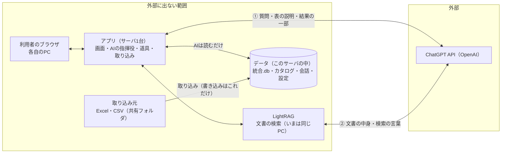
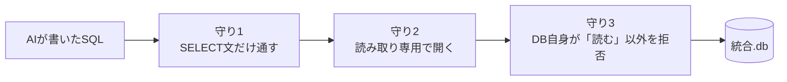

# AIワークハブ システム概要

2026年10月版。発表用スライド（23枚）の内容を、読み物としてまとめたものです。
スライドの元データは [スライド元データ/](スライド元データ/) にあります（`deck.json` と `slides/*.html`）。

**目次**

1. アプリの紹介（開発の背景・解決したい課題・アプリの概要・効果）
2. ① システム設計図
3. ② セキュリティ設計
4. ③ 安全設計
5. ④ 使用技術とデータの流れ（ツール呼び出しの仕組みとコード）
6. この先の展望
7. まとめ
8. 発表・運用のための注意

---

## 1. アプリの紹介

### 開発の背景

- **データはあるが、散らばっている** — 生産・品質・在庫・売上などのデータが、部署ごとの Excel・CSV に分かれて置かれている。
- **AIに「聞けば分かる」が現実に** — 生成AIの進歩で、日本語で質問すれば、データを調べて答えてもらえるようになった。
- **ただし、データ本体は外部に出せない** — 業務データを一般のAIサービスにそのまま入れるのは、情報漏えいの心配がある。

> **ねらい**：データ本体は手元に置いたまま、だれでも日本語でデータを使えるようにする。

### 解決したい課題

| いまの課題 | このアプリで |
|---|---|
| 欲しい数字が出るまで、詳しい人に頼んで待つ | 日本語で聞けば、その場でAIが調べて答える |
| 集計・分析ができる人が限られ、負担が集中する | 集計・統計・予測・グラフまで、AIが道具を使って行う |
| 毎月同じ集計や資料づくりを、手作業でくり返す | うまくいった手順を「マイロボット」で自動実行 |
| 規定・手順書などの文書から、必要な所を探しにくい | 文書検索（LightRAG）で、データと文書をまとめて調べる |
| 業務データを、そのまま外部のAIに入れられない | AIには必要な分だけを渡し、データ本体は手元に置く |

### アプリの概要：日本語で聞くと、AIが調べて答える

利用者が「先月の不良件数は？」のように日本語で聞くと、AIとアプリが関係する表を選んでSQLで集計し、必要なら文書も検索して、文章・表・グラフで答えます。Excel・Word・PowerPoint のファイルにも出力できます。

| 使い方 | 内容 |
|---|---|
| 聞いて答えを得る | 日本語の質問に、データを調べて答える。実行したSQLも見られる |
| 分析・資料づくり | 統計・予測・グラフ。Excel・Word・PowerPoint で出力できる |
| 文書を調べる | 規定・手順書などを検索し、データと合わせて答える |
| マイロボット | うまくいった手順を登録し、決めた時刻に自動で実行・配信 |

管理者は、データの取り込み（Excel・CSV）と、表の説明（カタログ）を整えます。

### 効果

| 効果 | 内容 |
|---|---|
| 待ち時間が減る | 欲しい数字を、その場で自分で確かめられる |
| だれでも分析できる | SQLや関数を知らなくても、集計・統計・グラフまでできる |
| 定型作業を自動化 | 毎月の集計・報告を、マイロボットに任せられる |
| 数字の根拠が残る | 実行したSQLが回答に残り、数字の出どころを確かめられる |
| 安心して生成AIを使える | データ本体は手元に置き、AIには必要な分だけを渡す |

---

## 2. ① システム設計図：アプリはサーバ1台で動き、データ本体は外部に出ない



- アプリはサーバ1台で動き、利用者は各自のPCのブラウザから使います。
- データベース（統合.db）、表の説明をまとめたカタログ、会話の記録や設定は、すべてこのサーバの中にあり、外部には出ません。
- 外部とつながるのは ChatGPT API（OpenAI）だけです。線は2本あり、①はアプリが質問に答えるとき、②は LightRAG が文書の索引を作るときと検索するときに使います。
- ②は、いまの（開発用の）LightRAG の設定です。本番では IT 部門が用意する LightRAG を使う予定で、そのときに使うAIは、その LightRAG の設定に従います。
- AIはデータを読むだけで、データベースに書き込めるのは管理者が行う「取り込み」だけです。

---

## 3. ② セキュリティ設計

### 外部とつながるのは ChatGPT API（OpenAI）だけ

| 接続先 | 場所 | いつ・何のために |
|---|---|---|
| **ChatGPT API（OpenAI）** | **外部（唯一の接続先）** | 質問に答えるとき（アプリ）／文書の索引づくりと検索（LightRAG） |
| LightRAG（文書検索） | 外部に出ない（いまはアプリと同じPC） | 文書を調べるとき（本番は IT 部門が用意するサーバの予定） |
| メールの中継サーバ | 管理者が指定（自社のサーバを想定） | 設定したときだけ（いまは未設定） |
| 外部の部品・アクセス解析・自動更新 | なし | 使っていない（グラフの部品もアプリに同梱） |

画面は外部のサイトから何も読み込みません（フォント・部品・アクセス解析なし）。利用状況の送信や、自動更新の確認のような「裏の通信」もありません。Webから情報を取ってくる「スクレイピング」の仕組みはありますが、いまは見本だけで、使っていません。

### AIに渡すのは、答えるのに必要な分だけ

**AIに渡るもの（外部に出る）**

- 質問の文章（その会話のやり取りを含む）
- 表と列の説明（値の例・範囲、表ごとの見本3行まで）
- 検索結果の一部（1回につき最大40行。画面には最大2,000行）
- 文書検索の結果の抜粋
- 本人の「記憶」メモ（過去のやり取りから作るメモ。本人が設定で止められる）
- 文書の中身（いまの LightRAG が索引を作るとき）

**AIに渡らないもの（外部に出ない）**

- データベースのファイル・全件のデータ
- パスワード・APIキー
- 他の人の会話・マイロボット・記憶メモ
- 利用者が対象から外した表（AIへの説明から消すだけでなく、データベースを読む段階でも拒否する）
- 文書の元のファイル

ログイン必須です。管理者の画面は管理者だけ、会話とマイロボットは本人だけが使えます。この判定は画面ではなく、毎回サーバ側で行います。

### メールも、外部のアドレスには送れない


- 管理者は「メール設定」で、登録してよいドメイン（自社のドメイン）を決めます。それ以外のアドレスは、宛先の許可リストにそもそも登録できません（サブドメインは含む）。
- 送る直前に、To・Cc・Bcc の全員が許可リストに載っているかを確かめ、1人でも外れていれば送りません。
- **許可リストが空なら、誰にも送れません。** 設定を忘れても、外部へ出ていかない作りです。
- AIが作るのは下書きまでで、送るのは利用者が中身を確かめて「送信」を押したときです。マイロボットの自動送信も同じ点検を通ります。取り込みの失敗を知らせる管理者の宛先も、同じドメインの縛りを受けます。
- 一度に送れる宛先には上限があります（初期値20件）。送ったメールは、宛先・件名・送った人を記録します。

---

## 4. ③ 安全設計

### AIはデータを書き換えられない（3重の守り）



- 守り1：アプリの検査で、読み取りの命令（SELECT）以外は通しません。
- 守り2：データベースを読み取り専用で開きます。
- 守り3：データベース（SQLite）自身の許可の仕組み（オーソライザ）で、読む以外の操作をすべて拒否します。利用者が外した表も、この段階で読めません（AIが名前を知っていても読めない）。
- どれか1つをすり抜けても、残りで止まる作りです。データを書き込めるのは、管理者の「取り込み」だけです。

### 壊さない・混ざらない仕組み

| 仕組み | 内容 |
|---|---|
| 取り込みは全部か、何もしないか | 途中で失敗したら元のデータのまま。空のファイルでは入れ替えない |
| 書きかけで壊れない | 設定は別の一時ファイルに書いてから、一度に置き換える |
| 同時の操作は順番に | 取り込み・会話・カタログの保存は、鍵をかけて1つずつ |
| 古い画面から上書きしない | 開いたあとに誰かが変えていたら、保存せずに知らせる |
| 消す前に影響を見せる | 削除・改名は関係先を一覧し、説明や予定も一緒に直す |
| 変更のたびに検証 | 検証スイート44本・約3,200項目を毎回実行 |

---

## 5. ④ 使用技術とデータの流れ

### 使用技術：一般的な部品を、サーバ1台に組み合わせる

| 役割 | 使っているもの |
|---|---|
| 言語・サーバ | Python 3.13 ／ Flask ＋ waitress（32人分を同時に処理） |
| データベース | SQLite（ファイル1つ「統合.db」。取り込み中でも読める方式＝WAL） |
| AI | ChatGPT API（OpenAI。開発中は同じ作りのままローカルのAIに差し替え可） |
| AIと道具の連携 | **ツール呼び出し（Tool Calling）**：40種類以上の道具をAIが選び、アプリが実行 |
| 文書検索 | LightRAG（いまはアプリと同じPC。中で OpenAI の API を使う） |
| 分析 | pandas・SciPy・statsmodels（集計・統計・予測） |
| 出力 | Excel・Word・PowerPoint・グラフ（Plotly） |
| 画面の部品 | HTML・CSS・JavaScript（外部からの読み込みなし） |

### ツール呼び出し（Tool Calling）の全体像：AIとアプリの「やり取り」で答えを作る

ツール呼び出しは、ChatGPT API に標準で備わっている仕組みです。AIは「依頼」を出すだけで、実行するのはアプリです。

| # | 向き | やり取り |
|---|---|---|
| 1 | アプリ → AI | 「先月の不良件数は？」と、使える道具の一覧を送る |
| 2 | AI → アプリ | 「run_sql_query を、このSQLで使って」と依頼が返る |
| 3 | アプリの中 | SQLを実行（読むだけ）→ 結果は「件数 12」 |
| 4 | アプリ → AI | 「件数 12」という結果を返す（最大40行） |
| 5 | AI → アプリ | 「先月の不良件数は12件です」と最終回答が返る |

2〜4 は、AIが必要とするかぎりくり返します（最大10回）。

以下、ステップごとのコードは説明用に短くしたものです（日本語の名前は説明のための仮の名前です）。

#### ステップ1：質問と「道具の一覧」をAIに送る（アプリ → 外部）

```python
# 道具の一覧（AIに見せるのは名前・説明・引数の形だけ）
tools = [{"type": "function", "function": {
    "name": "run_sql_query",
    "description": "読み取り専用のSELECT文を実行する",
    "parameters": {"type": "object", "properties": {
        "sql": {"type": "string"},
        "purpose": {"type": "string"}},
        "required": ["sql", "purpose"]}}}]

# 会話（最初は「決まりごと＋表の説明」と質問）
messages = [
    {"role": "system", "content": 決まりごと + 表の説明},
    {"role": "user", "content": "先月の不良件数は？"}]

resp = client.chat.completions.create(  # 外部へ送る
    model=MODEL, messages=messages, tools=tools)
```

- 外部（ChatGPT API）に送るもの：答え方の決まり（システムへの指示）、表と列の説明（値の例・範囲、表ごとの見本3行まで）、質問、道具の一覧（名前・説明・引数の形）。
- 送らないもの：データベースのファイル・全件のデータ、道具のプログラム・パスワード・APIキー、利用者が対象から外した表の説明。
- 渡す道具は人によって変わります（管理者用の道具は一般の人に渡さない）。実際の道具は40種類以上あります（SQL・グラフ・統計・Excel出力・文書検索など）。

#### ステップ2：AIから「依頼」が返ってくる（外部 → アプリ）

```python
msg = resp.choices[0].message

if msg.tool_calls:  # 依頼あり → ステップ3へ
    for call in msg.tool_calls:
        name = call.function.name  # "run_sql_query"
        args = json.loads(call.function.arguments)
        # args["sql"] に AI が書いた SQL が入っている
else:  # 依頼なし → ステップ5（最終回答）
    answer = msg.content
```

返ってくる中身（例。`arguments` は実際には文字列で届きます）：

```jsonc
{"role": "assistant",
 "content": null,                       // 文章は書かない
 "tool_calls": [{
   "id": "call_01",                     // 依頼の番号
   "function": {
     "name": "run_sql_query",           // 使う道具
     "arguments": {                     // 引数
       "sql": "SELECT COUNT(*) AS 件数 FROM 品質__不良記録
               WHERE strftime('%Y-%m', 発生日) = '2026-09'",
       "purpose": "先月の不良件数を数える"}}}]}
```

- AIは文章の代わりに「この道具を、この引数で」と依頼を返します。
- AIはデータベースに触れません。依頼を実行するかどうかはアプリが決めます。
- 1回の返事に、依頼が複数入ることもあります（順に実行する）。

#### ステップ3：アプリが道具を実行する（外部に出ない）

```python
if name not in 渡した道具:  # 渡していない道具は動かさない
    result = {"error": f"未知のツール: {name}"}
elif name in 管理者用の道具 and not 管理者:
    result = {"error": "管理者だけが使えます"}
else:
    sql = validate_select(args["sql"])  # 守り1: SELECTだけ通す
    conn = connect_readonly(統合db)      # 守り2: 読み取り専用
    conn.set_authorizer(読む以外は拒否)  # 守り3: DB自身が拒否
    cols, rows = 実行(conn, sql, 上限10秒, 最大2000行)
```

実行の結果（アプリの中だけで使う）：`cols = ["件数"]`、`rows = [(12,)]`

- 実行するのはこのサーバの中です。データベースは外部に出ません。
- AIが書いたSQLでも、3重の守り（③ 安全設計）で「読む」以外はできません。
- 渡していない道具・管理者用の道具は、名指しされても動かしません。
- 10秒を超えるSQLは止めます。画面に出すのは最大2,000行です。

#### ステップ4：結果の一部をAIに返す（アプリ → 外部）

```python
messages.append(msg)  # AIの依頼も会話に残す
messages.append({
    "role": "tool",
    "tool_call_id": call.id,  # どの依頼への答えか
    "content": json.dumps({
        "columns": cols,
        "rows": rows[:40],  # AIに渡すのは最大40行
        "row_count": len(rows)}, ensure_ascii=False)})

resp = client.chat.completions.create(  # もう一度AIへ
    model=MODEL, messages=messages, tools=tools)
```

送る中身（例。`content` は実際には文字列で送ります）：

```jsonc
{"role": "tool",
 "tool_call_id": "call_01",             // 依頼の番号
 "content": {
   "columns": ["件数"],
   "rows": [[12]],                      // 最大40行まで
   "row_count": 1}}
```

- 外部に出るのは結果の一部（最大40行）だけです。全件やDBファイルは送りません。
- AIは結果を読み、足りなければまた依頼します（ステップ2に戻る）。
- 1つの質問で、この往復は最大10回までです。

#### ステップ5：依頼が無くなったら、最終回答（外部 → アプリ → 画面）

```python
for 回数 in range(10):  # 往復は最大10回
    msg = AIに聞く(messages, tools)  # ステップ1・4の create()
    if not msg.tool_calls:  # 依頼が無い＝最終回答
        画面に表示(msg.content, 表, グラフ, 実行したSQL)
        break
    ...  # ステップ3・4（実行して、結果を返す）
else:  # 10回で終わらなかったとき
    画面に表示("10回で区切りました。「続けて」で再開できます")
```

返ってくる中身（例）：

```jsonc
{"role": "assistant",
 "content": "2026年9月の不良件数は12件でした。",
 "tool_calls": null}                    // 依頼なし
```

- 画面に出るもの：回答の文章（少しずつ表示）、表やグラフ（全件はアプリの中から）、実行したSQL（数字の根拠）。
- 同じ依頼のくり返しは、実行せずに差し戻します。
- 10回で区切り、「続けて」と送れば再開できます。

#### まとめ：全体をつなげると、これだけのコード

```python
# ステップ1: AIに渡す道具の一覧（名前・説明・引数の形）
tools = [{"type": "function", "function": {
    "name": "run_sql_query",
    "description": "読み取り専用のSELECT文を実行する",
    "parameters": {"type": "object",
        "properties": {"sql": {"type": "string"}}}}}]

messages = [{"role": "user", "content": "先月の不良件数は？"}]
for _ in range(10):  # 最大10往復
    msg = client.chat.completions.create(  # ステップ2: 依頼か回答が返る
        model=MODEL, messages=messages, tools=tools).choices[0].message
    messages.append(msg)
    if not msg.tool_calls:  # ステップ5: 依頼が無ければ最終回答
        break
    for call in msg.tool_calls:  # ステップ3・4: 実行して結果を返す
        rows = run_select(json.loads(call.function.arguments)["sql"])
        messages.append({"role": "tool", "tool_call_id": call.id,
                         "content": json.dumps(rows[:40])})  # 最大40行
```

実際のアプリは、これに40種類以上の道具、利用者の権限の確認、同じ依頼のくり返しの差し戻し、エラーを分かる言葉に直す処理、画面への逐次表示などを足したものです。

### 質問してから答えが出るまで

| # | 場所 | 処理 |
|---|---|---|
| 1 | 外部に出ない | 利用者が日本語で質問する |
| 2 | 外部に出ない | アプリが関係する表を選び、表の説明を添える |
| 3 | 外部（ChatGPT API） | ChatGPT API が使う道具と引数を決める（ツール呼び出し） |
| 4 | 外部に出ない＊ | アプリが読むだけのSQL・文書検索を実行 |
| 5 | 外部へ送る | 結果の一部をAIに返す（必要なら3〜5を繰り返す） |
| 6 | 外部に出ない | 回答・表・グラフを画面に少しずつ表示 |

＊文書検索のときは、LightRAG が検索の言葉を同じ ChatGPT API（OpenAI）に送ります。
AIは「どう調べるか」を考えるだけで、実際にデータを読むのは、外部に出ないアプリの中です。実行したSQLは回答に必ず残ります。

### データが入る道と、繰り返しの自動化

| 道 | 流れ |
|---|---|
| 取り込み | Excel・CSV（共有フォルダ） → 列と型を確かめ、見本で確認 → 統合.db に書き込む（全部か、何もしないか） |
| 自動の更新 | 定期取り込み（決めた間隔で入れ替え・追記） ／ リアルタイム（元ファイルが変わったら質問の前に。読めなければ前回の内容のまま） ／ 二重に取り込まない（鍵で1本ずつ） |
| マイロボット | うまくいった質問の手順を登録 → 決めた時刻にAIなしで同じ手順を実行 → Excel・メールで届ける |

---

## 6. この先の展望：いまの作りの延長で、できることを広げる

| 展望 | 内容 |
|---|---|
| 使えるデータを広げる | 他部署・他システムのデータも取り込み、日本語で聞ける範囲を増やす |
| 定型業務のロボット化 | 週次・月次の集計や報告をマイロボットにして、決まった時刻に自動で届ける |
| 答えの正確さを上げる | 表の説明・業務用語・質問の例文（カタログ）を育て、AIの取り違えを減らす |
| 外部との通信をゼロにする選択肢 | アプリのAIは、設定だけで、このPCで動くAI（ローカルLLM）に切り替えられる。LightRAG も同じように設定できる。速さや答えの質との兼ね合いで判断する |

---

## 7. まとめ

1. 外部との通信は ChatGPT API（OpenAI）の1か所だけ。メールも外部のアドレスには送れない。
2. AIは読むだけ。書き込めるのは管理者の取り込みだけ。
3. 壊さない・混ざらない仕組みを、約3,200項目の検証で毎回確認。

---

## 8. 発表・運用のための注意

- **ChatGPT API の扱い**：送ったデータの扱い（学習に使われない等）は、API の契約と規約で確認した内容を添えること。
- **メールの「登録してよいドメイン」**：初期値は空（ドメインの縛りなし）。メールを使い始める前に、自社のドメインを設定すること。いまはメール自体が未設定で、初期状態は「テスト送信（実際には送らない）」。
- **LightRAG**：この資料の LightRAG の記述（同じPC・OpenAI を使用）は、いまの開発用の構成。本番では IT 部門が用意する LightRAG を使う予定で、その設定に従う。
- **効果の数字**：作業時間の変化など実績の数字があれば、「効果」に書き足すと伝わりやすい。
